# MechSage — Agentic Predictive Maintenance Copilot

MechSage is a production-grade, full-stack predictive maintenance application for Turbofan Engine Units. It integrates machine learning (RUL prognosis & Isolation Forest anomaly detection) with a LangGraph multi-agent diagnostic workflow and a Retrieval-Augmented Generation (RAG) technical manuals search engine, exposed through a high-frequency real-time dashboard.

---

## 🏗️ System Architecture

```mermaid
flowchart TD
    subgraph FE["🖥️ Frontend — Next.js 14 App Router (TypeScript)"]
        P1["/fleet\n(Live KPI Cards + Engine Grid)"]
        P2["/engines/[id]\n(RUL Trajectory + SHAP + Anomaly Charts)"]
        P3["/workorders\n(Work Order Table + HITL Queue)"]
        P4["/rag\n(RAG Manuals Search Console)"]
        P5["/agent\n(Agent Run Trace Viewer)"]
      style FE fill:#0A0F1E,stroke:#3B82F6,stroke-width:2px;
    end

    subgraph BE["🔌 Backend — FastAPI"]
        R1["POST /api/v1/infer\n(cycle prediction)"]
        R2["POST /api/v1/agent/run\n(5-node LangGraph execution)"]
        R3["POST /api/v1/rag/query\n(hybrid RAG + rerank)"]
        R4["GET|PATCH /api/v1/workorders\n(CRUD + HITL approval)"]
        R5["GET /api/v1/metrics\n(fleet health JSON)"]
        WS["WebSocket /ws/fleet\n(real-time push)"]
      style BE fill:#111827,stroke:#00D4AA,stroke-width:2px;
    end

    subgraph CORE["⚙️ Existing Core ML/Agent Layers"]
        INF["inference/predictor.py\n(8 loaded .joblib models)"]
        AG["dev/agentic/graph.py\n(mechsage_graph)"]
        RAG["dev/rag/rag_pipeline.py\n(dense + sparse retrieval)"]
    end

    subgraph DB["💾 Persistence"]
        SQL["SQLite (dev) / PostgreSQL (prod)\nWorkOrder, HITLEvent, AuditLog"]
        CHROMA["ChromaDB\nRAG vector store"]
    end

    FE -->|REST + WebSocket| BE
    BE --> INF
    BE --> AG
    BE --> RAG
    AG --> SQL
    R4 --> SQL
    RAG --> CHROMA
```



---

## 🛠️ Technology Stack

* **Backend**: FastAPI (Python 3.11), SQLAlchemy, Uvicorn, Structlog, Pydantic v2.
* **Frontend**: Next.js 14 (App Router, React 19, TypeScript), TailwindCSS, Recharts, Zustand, TanStack Query v5.
* **Database**: SQLite (Local Dev) / PostgreSQL (Production).
* **Machine Learning**: Scikit-Learn, LightGBM (Anomaly Detection & RUL prediction).
* **DevOps**: Docker, Docker Compose, GitHub Actions.

---

## 🚀 Getting Started

### 1. Pre-requisites
* Python 3.11+
* Node.js 20+
* Docker & Docker Compose (optional, for containerized run)

### 2. Environment Variables Configuration
Copy `.env.example` to `.env` and fill in your details:
```bash
cp .env.example .env
```
Key configuration settings:
* `LLM_PROVIDER`: `openai` | `gemini`
* `OPENAI_API_KEY` or `GOOGLE_API_KEY`: Required for LangGraph/RAG generation.
* `DATABASE_URL`: `sqlite:///./mechsage.db` (default)
* `REQUIRE_API_KEY`: `false` (set to `true` to enable X-API-Key header authentication)

---

## 💻 Local Development Setup

### 1. Start the FastAPI Backend
From the root directory:
```bash
# Install dependencies
pip install -r backend/requirements.txt

# Run the server (auto-creates database tables & loads model artifacts)
uvicorn backend.main:app --reload --host 127.0.0.1 --port 8000
```
Swagger API docs will be available at [http://127.0.0.1:8000/docs](http://127.0.0.1:8000/docs).

### 2. Start the Next.js Frontend
From the `frontend` directory:
```bash
# Install dependencies
npm install

# Run the development server
npm run dev
```
Open [http://localhost:3000](http://localhost:3000) to view the live dashboard.

---

## 🐳 Docker Orchestration

You can build and spin up the entire full-stack application using a single command:
```bash
docker-compose up --build
```
This launches:
* **Backend API**: [http://localhost:8000](http://localhost:8000)
* **Frontend UI**: [http://localhost:3000](http://localhost:3000)

---

## 🧪 Running Verification Tests

### 1. Backend Pytest Suite
Run unit tests, including inference schemas, database CRUD, and RAG guardrail verifications:
```bash
pytest backend/tests/ --cov=backend
```

### 2. Frontend Unit Tests
Verify MetricCard layout renders and handles props properly:
```bash
cd frontend
npm run test
```

### 3. Playwright E2E Tests
Validate redirect logic and fleet dashboard card clicks:
```bash
cd frontend
npx playwright test
```
